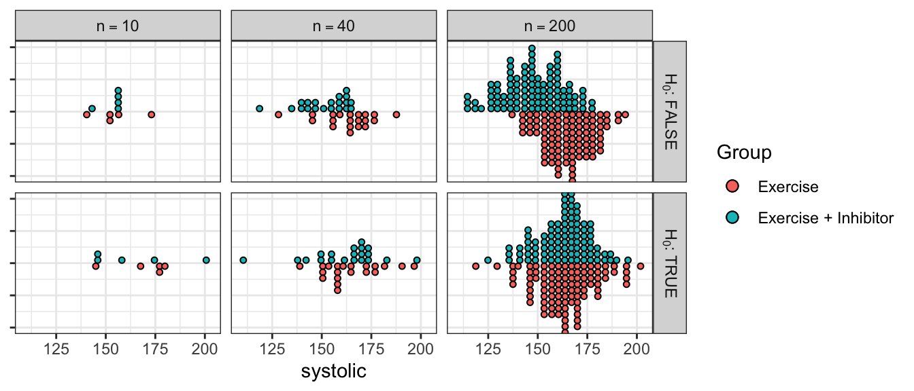
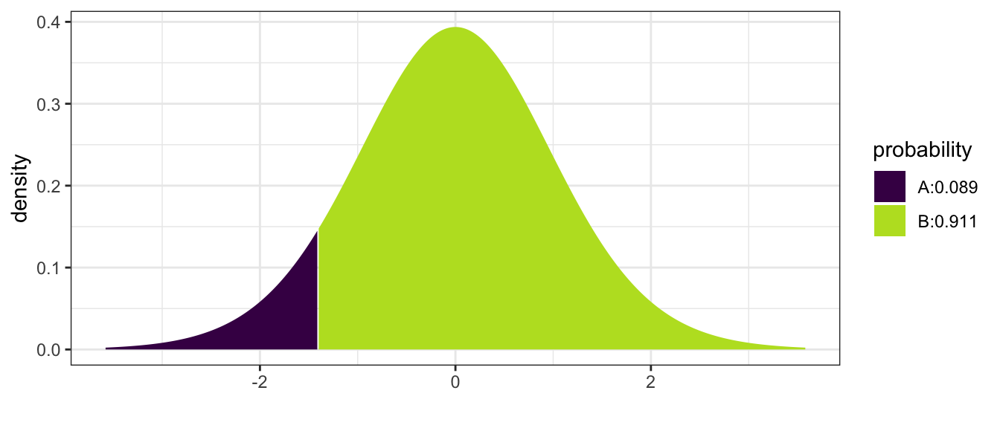
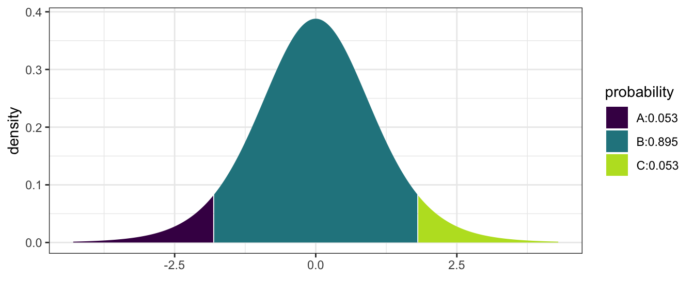
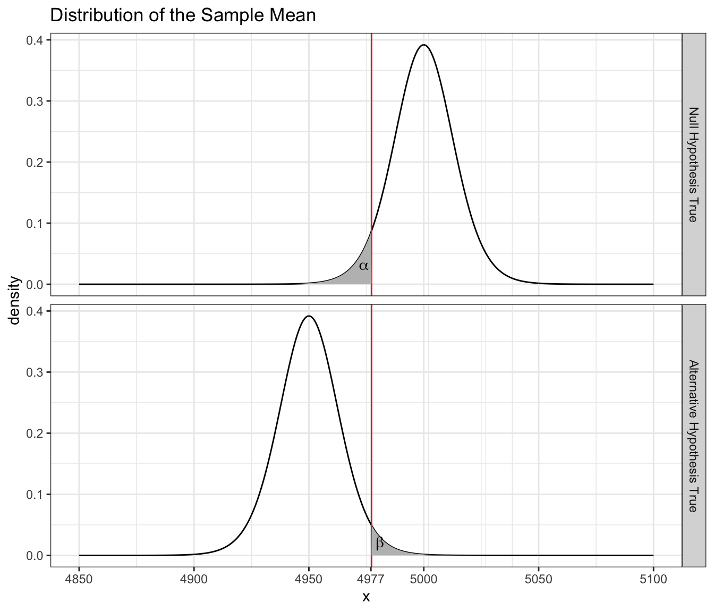

# Hypothesis Tests for the mean of a population

**Chapter still being edited.**


```r
library(dplyr)
library(tidyr)
library(ggplot2)

# Set default behavior of ggplot2 graphs to be black/white theme
theme_set(theme_bw())
```

Science is about observing how the world works, making a conjecture (or hypothesis) about the mechanism and then performing experiments to see if real data agrees or disagrees with the proposed hypothesis. 

**Example:** Suppose Rancher A wants to buy some calves from Rancher B. Rancher B claims that the average weight of his calves is 500 pounds. Rancher A decides to buy 10 calves. A few days later he starts looking at the cows and begins to wonder if the average really is 500 pounds. Rancher A weighs his 10 calves and the sample mean is $\bar{x}=475$ and the sample standard deviation is $s=50$. Below are the data


```r
cows <- data.frame(    
  weight = c(553, 466, 451, 421, 523, 517, 451, 510, 392, 466) )
cows %>% summarise( xbar=mean(weight), s=sd(weight) )
```

```
##   xbar        s
## 1  475 49.99556
```

There are two possibilities. Either Rancher A was just unlucky in his random selection of 10 calves from the heard, or the true average weight within the herd is less than 500. 

$$H_{0}:\;\mu	=	500$$
$$H_{a}:\;\mu	<	500$$
  

For this calculation we'll assume the weight of a calf is normally distributed $N\left(\mu,\sigma\right)$, and therefore $\bar{X}$ is normally distributed $N\left(\mu,\frac{\sigma}{\sqrt{n}}\right)$. If true mean is 500, how likely is it to get a sample mean of 475 (or less)? One way to think about this is that we want a measure of how extreme the event is that we observed, and one way to do that is to calculate how much probability there is for events that are even more extreme.

To calculate how far into the tail our observed sample mean $\bar{x}=475$ is by measuring the area of the distribution that is farther into the tail than the observed value.

$$\begin{aligned}P\left(\bar{X}\le475\right)	
    &= P\left(\frac{\bar{X}-\mu}{\left(\frac{s}{\sqrt{n}}\right)}\le\frac{475-500}{\left(\frac{50}{\sqrt{10}}\right)}\right) \\
	  &= P\left(T_{9}\le-1.58\right) \\
	  &=	0.074 \end{aligned}$$
 

We see that the observed $\bar{X}$ is in the tail of the distribution and tends to not support $H_{0}$.

P-value is the probability of seeing the observed data or something more extreme given the null hypothesis is true. By “something more extreme”, we mean samples that would be more evidence for the alternative hypothesis.

$$\mbox{p-value}=P(T_{9}<-1.58)=0.074$$
 

The above value is the actual value calculated using R


```r
#        pt(-1.58, df=9)           # No Graph
mosaic::xpt(-1.58, df=9, ncp=0)    # With a graph; Non-Centrality Parameter = 0
```


```
## [1] 0.07428219
```


but using tables typically found in intro statistics books, the most precise thing you would be able to say is $0.05 \le \mbox{p-value} \le 0.10$ So there is a small chance that Rancher A just got unlucky with his ten calves. While the data isn't entirely supportive of $H_{0}$, we don't have strong enough data to out right reject $H_{0}$. So we will say that we fail to reject $H_{0}$. Notice that we aren't saying that we accept the null hypothesis, only that there is insufficient evidence to call Rancher B a liar. 

## Writing Hypotheses

### Null and alternative hypotheses

In elementary school most students are taught the scientific method follows the following steps:

1. Ask a question of interest.
2. Construct a hypothesis.
3. Design and conduct an experiment that challenges the hypothesis.
4. Depending on how consistent the data is with the hypothesis:
    a) If the observed data is inconsistent with the hypothesis, then we have proven it wrong and we should consider competing hypotheses.
    b) If the observed data is consistent with the hypothesis, design a more rigorous experiment to continue testing the hypothesis.

Through the iterative process of testing ideas and refining them under the ever growing body of evidence, we continually improve our understanding of how our universe works. The heart of the scientific method is the falsification of hypothesis and statistics is the tool we'll use to assess the consistency of our data with a hypothesis. 

Science is done by examining competing ideas for how the world works and throwing evidence at them. Each time a hypothesis is removed, the remaining hypotheses appear to be more credible. This doesn't mean the remaining hypotheses are correct, only that they are consistent with the available data.

1. In approximately 300 BC, [Eratosthenes](http://en.wikipedia.org/wiki/Eratosthenes) showed that the world was not flat. (Carl Sagan has an excellent episode of Cosmos on this [topic](https://www.youtube.com/watch?v=G8cbIWMv0rI). He did this by measuring the different lengths of shadows of identical sticks in two cities that were 580 miles apart but lay on the same meridian (Alexandria is directly north of Aswan). His proposed alternative was that the Earth was a sphere. While his alternative is not technically true (it is actually an oblate spheroid that bulges at the equator), it was substantially better than the flat world hypothesis.

2. At one point it was believed that plants “ate” the soil and turned it into plant mass. An experiment to test this hypothesis was performed by Johannes Baptista van Helmont in 1648 in which he put exactly 200 pounds of soil in a pot and then grew a willow tree out of it for five years. At the end of the experiment, the pot contained 199.875 pounds of soil and 168 pounds of willow tree. He correctly concluded that the plant matter was not substantially taken from the soil but incorrectly jumped to the conclusion that the mass must of have come from the water that was used to irrigate the willow. 

It is helpful to our understanding to label the different hypotheses, both the ones being tested and the different alternatives. We'll label the hypothesis being tested as $H_{0}$ which we often refer to as the **null hypothesis**. The **alternative hypothesis**, which we'll denote $H_{a}$, should be the opposite of the null hypothesis. Had Eratosthenes known about modern scientific methods, he would have correctly considered $H_{0}$: the world is flat verses $H_{a}$: the world is not flat and not incorrectly concluded that the world is a sphere. Amusingly Eratosthenes' data wasn't inconsistent with the hypothesis that the world was shaped like a doughnut, but he thought the sphere to be more likely. Likewise Helmont should have considered the hypotheses $H_{0}$: plants only consume soil versus the alternative $H_{a}$: plants consume something besides soil.

In both cases, the observed data was compared to what would have been expected if the null hypothesis was true. If the null was true Eratosthenes would have seen the same length shadow in both cities and Helmont would have seen 168 pounds of willow tree and $200-168=32$ pounds of soil remaining.

### Error

Unfortunately the world is not a simple place and experiments rarely can isolate exactly the hypothesis being tested. We can repeat an experiment and get slightly different results each time due to variation in weather, temperature, or diligence of the researcher. If we are testing the effectiveness of a new drug to treat a particular disease, we don't trust the results of a single patient, instead we wish to examine many patients (some that receive the new drug and some the receive the old) to average out the noise between the patients. The questions about how many patients do we need to have and how large of a difference between the treatments is large enough to conclude the new drug is better are the heart of modern statistics.

Suppose we consider the population of all US men aged 40-60 with high blood pressure (there might be about 20 million people in this population). We want to know if exercise and ACE inhibitors lower systolic blood pressure better than exercise alone for these people. We'll consider the null hypothesis that exercise is equivalent to exercise and ACE inhibitors versus exercise is different than exercise and ACE inhibitors. If we could take every single member of the population and expose them to exercise or exercise with ACE inhibitors, we would know for certain how the population reacts to the different treatments. Unfortunately this is too expensive and ethically dubious. 

Instead of testing the entire population we'll take a sample of $n$ men from the population and treat half of them with exercise alone and half of them with exercise and ACE inhibitors. What might our data look like if there is a difference between the two treatments at different samples sizes compared to if there is no difference? At small sample sizes it is difficult to distinguish the effect of the treatment when it is masked by individual variation. At high sample sizes, the individual variation is smoothed out and the difference between the treatments can be readily seen.



Comparing possible data assuming there is a difference between treatments versus no difference. In the top row of graphs, there is a difference between the Exercise and the Exercise + Inhibitor treatments. However, at small sample sizes, we can't tell if the observed difference is due to the difference in treatment or just random variation in the data. In the second row, there is no difference between the treatments.

When the sample size is large it is easy to see if the treatments differ in their effect on systolic blood pressure, but at medium or small sample sizes, the question is much harder. It is important to recognize that the core of the problem is still “is the observed data consistent with the null hypothesis?” but we now have to consider an addition variability term that is unrelated to the research hypothesis of interest. In the above example, the small sample data is consistent with the null hypothesis even when the null hypothesis is false!

## Conducting a Hypothesis Test for $\mu$

Perhaps the hardest part about conducting a hypothesis test is figuring out what the null and alternative hypothesis should be. The null hypothesis is a statement about a population parameter. 
$$H_{0}:\mbox{ population parameter = hypothesized value}$$
  and the alternative will be one of 
$$\begin{aligned} 
  H_{a}:	\textrm{population parameter }  &<   \textrm{ hypothesized value} \\	
  H_{a}:	\textrm{population parameter }  &>   \textrm{ hypothesized value} \\	
  H_{a}:	\textrm{population parameter }  &\ne \textrm{ hypothesized value}
\end{aligned}$$
The hard part is figuring which of the possible alternatives we should examine. The alternative hypothesis is what the researcher believes is true. By showing that the complement of $H_{a}$ (that is $H_{0}$) can not be true, we support the alternative which we believe to be true.

$H_{0}$ is often a statement of no effect, or no difference between the claimed and observed.

**Example:** A light bulb company advertises that their bulbs last for 1000 hours. Consumers will be unhappy if the bulbs last less time, but will not mind if the bulbs last longer. Therefore Consumer Reports might perform a test and would consider the hypotheses 
$$H_{0}:\;\mu	=	1000$$
$$H_{a}:\;\mu	<	1000$$
 
Suppose we perform an experiment with $n=20$ light bulbs and observe $\bar{x}=980$ and $s=64$ hours and therefore our test statistic is
$$ t_{19}	=	\frac{\bar{x}-\mu}{s/\sqrt{n}} =	\frac{980-1000}{64/\sqrt{20}} =	-1.40$$
Then the p-value would be


```r
#        pt(-1.4, df=19)           # No Graph
mosaic::xpt(-1.4, df=19, ncp=0 )   # With a Graph
```



```
## [1] 0.08881538
```

and we calculate p-value $=P\left(T_{19}<-1.4\right)=0.0888$.  A conclusion can then be drawn based on a chosen significance level.  Most commonly $\alpha$ is set to be 5%, or $\alpha = 0.05$.  In this case, we would fail to reject $H_0$ and conclude at 5% significance that the data fails to reject $\mu = 1000$ hours.
 
**Example:** A computer company is buying resistors from another company. The resistors are supposed to have a resistance of $2$ Ohms and too much or too little resistance is bad. Here we would be testing 
$$\begin{aligned} 
  H_{0}:\mbox{ }\mu	&=	  2 \\    
  H_{a}:\mbox{ }\mu	&\ne	2 
  \end{aligned}$$
  

Suppose we perform a test of a random sample of resistors and obtain a test statistics of $t_{9}=1.8$. Because the p-value is “the probability of your data or something more extreme” and in this case more extreme implies extreme values in both tails then


```r
mosaic::xpt( c(-1.8, 1.8), df=9, ncp=0)
```



```
## [1] 0.05269534 0.94730466
```

and we calculate
$$\textrm{p-value} = P\left(\left|T_{9}\right|>1.8\right)=2P\left(T_{9}<-1.8\right)=2\left(0.0527\right)=0.105$$
 

using the R commands


```r
2 * pt(-1.8, df=9)
```

```
## [1] 0.1053907
```

This test would conclude that at 5% significance, we fail to reject $H_0$.  This indicates the data fails to reject that $\mu = 2$ Ohms and the resistors can be used under the conditions required.

### Why should hypotheses use $\mu$ and not $\bar{x}$?

There is no need to make a statistical test of the form 
$$\begin{aligned} 
  H_{0}:\;\bar{x}	&=	  3  \\
  H_{a}:\;\bar{x}	&\ne	3 
\end{aligned}$$

because we know the value of $\bar{x}$; we calculated the value there is no uncertainty to what it is. However I want to use the sample mean $\bar{x}$ as an estimate of the population mean $\mu$ and because I don't know what $\mu$ is but know that it should be somewhere near $\bar{x}$, my hypothesis test is a question about $\mu$ and if it is near the value stated in the null hypothesis. 

Hypotheses are always statements about population parameters such as $\mu$ or $\sigma$ and never about sample statistic values such as $\bar{x}$ or $s$.

### A note on calculating p-values

Students often get confused by looking up probabilities in tables and don't know which tail of the distribution supports the alternative hypothesis. This is further exacerbated by tables sometimes giving area to the left, sometimes area to the right, and R only giving area to the left. In general, your best approach to calculating p-values correctly is to draw the picture of the distribution of the test statistic (usually a t-distribution) and decide which tail(s) supports the alternative and figuring out the area farther out in the tail(s) than your test statistic. However, since some students need a more algorithmic set of instructions, the following will work:

1. If your alternative has a $\ne$ sign
    a) Look up the value of your test statistic in whatever table you are going to use and get some probability... which I'll call $p^{*}$. 
    b) Is $p^{*} > 0.5$? If so, you just looked up the area in the wrong tail. To fix your error, subtract from one... that is $p^{*} \leftarrow 1-p^{*}$
    c) Because this is a two sided test, multiply $p^{*}$ by two and that is your p-value. $\textrm{p-value}=2\left(p^{*}\right)$
    d) **A p-value is a probability and therefore must be in the range $[0,1]$. If what you've calculated is outside that range, you've made a mistake.**

2. If your alternative is $<$ (or $>$) then the p-value is the area to the left (or to the right) of your test statistic.
    a) Look up the value of your test statistic in whatever table you are using and get the probability... which again I'll call $p^{*}$
    b) If $p^{*} > 0.5$, then you have to consider if they alternative hypothesis was posed correctly or if you have made a mistake. **Be careful here, because if your alternative is “greater than” and your test statistic is negative, then the p-value *really is* greater than $0.5$.  The same holds true for an alternative of "less than" and a test statistic that is positive.**
    c) For a one-tailed test, the p-value is $p^{*}$ with no multiplication necessary.

## Additional Examples

1. A potato chip manufacturer advertises that it sells 16 ounces of chips per bag. A consumer advocacy group wants to test this claim. They take a sample of $n=18$ bags and carefully weights the contents of each bag and calculate a sample mean $\bar{x}=15.8$ oz and a sample standard deviation of $s=0.2$.
    a) State an appropriate null and alternative hypothesis. 
    $$\begin{aligned} H_{0}:\mu	 &=	16\mbox{ oz } \\
                      H_{a}:\mu	 &<	16\mbox{ oz }
    \end{aligned}$$
    b) Calculate an appropriate test statistic given the sample data. 
    $$t=\frac{\bar{x}-\mu_{0}}{\frac{s}{\sqrt{n}}}=\frac{15.8-16}{\frac{.2}{\sqrt{18}}}=-4.24$$
    c) Calculate the p-value. $$\mbox{p-value }=P(T_{17}<-4.24)=0.000276$$
    d) Do you reject or fail to reject the null hypothesis at the $\alpha=0.05$ level?  _Because the p-value is less than $\alpha=0.05$ we will reject the null hypothesis._ 
    e) State your conclusion in terms of the problem. _There is statistically significant evidence to conclude that the mean weight of chips is less than 16 oz._

2. A pharmaceutical company has developed an improved pain reliever and believes that it acts faster than the leading brand. It is well known that the leading brand takes $25$ minutes to act. They perform an experiment on $16$ people with pain and record the time until the patient notices pain relief. The sample mean is $\bar{x}=23$ minutes, and the sample standard deviation was $s=10$ minutes.
    a) State an appropriate null and alternative hypothesis. 
    $$\begin{aligned} H_{0}:\mu	 &=	25\mbox{ minutes } \\
                      H_{a}:\mu	 &<	25\mbox{ minutes }
    \end{aligned}$$
    b) Calculate an appropriate test statistic given the sample data. 
    $$t_{15}=\frac{\bar{x}-\mu_{0}}{\frac{s}{\sqrt{n}}}=\frac{23-25}{\frac{10}{\sqrt{16}}}=-0.8$$
    c) Calculate the p-value. $$\mbox{p-value }=P(T_{15}<-0.8)=0.218$$
    d) Do you reject or fail to reject the null hypothesis at the $\alpha=.10$ level?  
    _Since the p-value is larger than my $\alpha$-level, I will fail to reject the null hypothesis._ 
    e) State your conclusion in terms of the problem. _These data do not provide statistically significant evidence to conclude that this new pain reliever acts faster than the leading brand._

3. Consider the case of SAT test preparation course. They claim that their students perform better than the national average of 1019. We wish to perform a test to discover whether or not that is true. 
$$\begin{aligned} H_{0}:\,\mu	 &=	1019  \\
                  H_{a}:\,\mu	 &>	1019
\end{aligned}$$
    They take a sample of size $n=10$ and the sample mean is $\bar{x}=1020$, with a sample standard deviation $s=50$. The test statistic is $$t_{9}=\frac{\bar{x}-\mu_{0}}{\frac{s}{\sqrt{n}}}=\frac{1}{\frac{50}{\sqrt{10}}}=.06$$
    So the p-value is $\mbox{p-value }=P(T_{9}>.06)\approx0.5$ and we fail to reject the null hypothesis. However, what if they had performed this experiment with $n=20000$ students and gotten the same results?  $$t_{19999}=\frac{\bar{x}-\mu_{0}}{\frac{s}{\sqrt{n}}}=\frac{1}{\frac{50}{\sqrt{20000}}}=2.83$$ and thus $\mbox{p-value }=P(T_{19999}>2.83)=0.0023$ At $\alpha=.05$, we will reject the null hypothesis and conclude that there is statistically significant evidence that the students who take the course perform better than the national average.

So what just happened and what does “statistically significant” mean? It appears that there is very slight difference between the students who take the course versus those that don't. With a small sample size we can not detect that difference, but by taking a large sample size, I can detect the difference of even 1 SAT point. So here I would say that there is a statistical difference between the students who take the course versus those that don't because given such a large sample, we are very unlikely to see a sample mean of $\bar{x}=1020$ if the true mean is $\mu=1019$. So statistically significant really means “unlikely to occur by random chance”.

But is there a practical difference in 1 SAT point? Not really. Since SAT scores are measured in multiple of 5 (you can score 1015, or 1020, but not 1019), there isn't any practical value of raising a students score by 1 point. By taking a sample so large, I have been able to detect a completely worthless difference.

Thus we have an example of a statistically significant difference, but it is not a practical difference. 

## P-values vs cutoff values

We have been calculating p-values and then comparing those values to the desired alpha level. It is possible, however, to use the alpha level to back-calculate a cutoff level for the test statistic, or even original sample mean. Often these cutoff values are referred to as critical values. Neither approach is wrong, but is generally a matter of preference, although knowing both techniques can be useful.

**Example:** We return to the pharmaceutical company that has developed a new pain reliever. Recall the null and alternative hypotheses were
$$\begin{aligned} H_{0}:\mu	 &=	25\mbox{ minutes } \\
                  H_{a}:\mu	 &<	25\mbox{ minutes } \end{aligned}$$
 and we had observed a test statistic 
 $$t=\frac{\bar{x}-\mu_{0}}{\frac{s}{\sqrt{n}}}=\frac{23-25}{\frac{10}{\sqrt{16}}}=-0.8$$ 
 with $15$ degrees of freedom. Using an $\alpha=0.10$ level of significance, if this test statistic is smaller than the $0.10$th quantile of a $t$-distribution with $15$ degrees of freedom, then we will reject the null hypothesis. This cutoff value is $t^{0.1}_{15} = t_{crit}=-1.341$.  This is shown below using R:
 

```r
 qt(0.1, df=15)
```

```
## [1] -1.340606
```
 
Because the observed test statistic $t_s = -0.8$ is less extreme (not as far into the tail) as the cutoff value $t_{crit} = -1.341$, we failed to reject the null hypothesis.

We can push this idea even farther and calculate a critical value on the original scale of $\bar{x}$ by solving 
$$\begin{aligned}
t_{crit}	&=	\frac{\bar{x}_{crit}-\mu_{0}}{\left( \frac{s}{\sqrt{n}} \right)} \\
\\
-1.341	  &=	\frac{\bar{x}_{crit}-25}{\left( \frac{10}{\sqrt{16}} \right) }    \\
-1.341\left(\frac{10}{\sqrt{16}}\right)+25	&=	\bar{x}_{crit}  \\
21.65	&=	\bar{x}_{crit}
\end{aligned}$$
 So if we observe a sample mean $\bar{x}<21.65$ then we would reject the null hypothesis. Here we actually observed $\bar{x}=23$ so this comparison still fails to reject the null hypothesis and concludes there is insufficient evidence to reject that the new pain reliever has the same time till relief as the old medicine.

In general calculating and reporting p-values is preferred, because they account for any ambiguity about one-sided or two-sided tests and how many degrees of freedom were available.

## Running a t-test in R

While it is possible to do t-tests by hand, most people will use a software package to perform these calculations. Here we will use the R function `t.test()`. This function expects a vector of data (so that it can calculate $\bar{x}$ and $s$) and a hypothesized value of $\mu$. 

*Example*. Suppose we have data regarding fuel economy of $5$ vehicles of the same make and model and we wish to test if the observed fuel economy is consistent with the advertised $31$ mpg at highway speeds. Assuming the fuel economy varies normally among cars of the same make and model, we test 
$$\begin{aligned} H_{0}:\,\mu	 &=	31 \\
                  H_{a}:\,\mu	 &\ne	31 \end{aligned}$$
and calculate


```r
cars <- data.frame(mpg = c(31.8, 32.1, 32.5, 30.9, 31.3))
cars %>% summarise(mean(mpg), sd(mpg))
```

```
##   mean(mpg)   sd(mpg)
## 1     31.72 0.6340347
```

The test statistic is:
$$t=\frac{\bar{x}-\mu_{0}}{s/\sqrt{n}}=\frac{31.72-31}{\left(\frac{0.634}{\sqrt{5}}\right)}=2.54$$
 

The p-value is
$$\textrm{p-value}=2\cdot P\left(T_{4}>2.54\right)=0.064$$
 

and a $95\%$ confidence interval is
$$\begin{aligned} 
\bar{x}	&\pm	t_{n-1}^{1-\alpha/2}\left(\frac{s}{\sqrt{n}}\right) \\
31.72	  &\pm	2.776445\left(\frac{0.63403}{\sqrt{5}}\right)       \\
31.72	  &\pm	0.7872 \\
		[30.93,\; & 32.51]
\end{aligned}$$

These results can be confirmed quickly through the use of `t.test()`.


```r
t.test( cars$mpg, mu=31, alternative='two.sided' )
```

```
## 
## 	One Sample t-test
## 
## data:  cars$mpg
## t = 2.5392, df = 4, p-value = 0.06403
## alternative hypothesis: true mean is not equal to 31
## 95 percent confidence interval:
##  30.93274 32.50726
## sample estimates:
## mean of x 
##     31.72
```

The `t.test()` function supports testing one-sided alternatives (`alternative='less'` or `alternative='greater'`) and more information can be found in the R help system using `help(t.test)`.

## Type I and Type II Errors

We can think of the p-value as measuring how much evidence we have for the null hypothesis. If the p-value is small, the evidence for the null hypothesis is small. Conversely if the p-value is large, then the data is supporting the null hypothesis.

There is an important philosophical debate about how much evidence do we need in order to reject the null hypothesis. Since the p-value is a measure of support for the null hypothesis, if the p-value drops below a specified threshold (call it $\alpha$), we will choose to reject the null hypothesis. Different scientific disciplines have different levels of rigor. Therefore, they set commonly used $\alpha$ levels differently. For example physicists demand a high degree of accuracy and consistency, thus might use $\alpha=0.01$, while ecologists deal with very messy data and might use an $\alpha=0.10$.

The most commonly used $\alpha$-level is $\alpha=0.05$, which is traditional due to an off-hand comment by R.A. Fisher. There is nothing that fundamentally forces us to use $\alpha=0.05$ other than tradition. However, when sociologists do experiments presenting subjects with unlikely events, it is usually when the events have a probability around $0.05$ that the subjects begin to suspect they are being duped. 

People who demand rigor might want to set $\alpha$ as low as possible, but there is a trade off. Consider the following possibilities, where the “True State of Nature” is along the top, and the decision is along the side. 

+----------------+-----------------+-----------------+
|                | $H_0$ **True**  | $H_0$ **False** |
+----------------+-----------------+-----------------+
| **Fail to      |  Correct        | Type II         |
| reject** $H_0$ |  Result         | Error ($\beta$) |
+----------------+-----------------+-----------------+
| **Reject**     | Type I          |  Correct        |
|    $H_0$       | Error ($\alpha$)|  Result         |
+----------------+-----------------+-----------------+

There are two ways to make a mistake. The type I error is to reject $H_{0}$ when it is true. This error is controlled by $\alpha$. We can think of $\alpha$ as the probability of rejecting $H_{0}$ when we shouldn't. However there is a trade off. If $\alpha$ is very small then we will fail to reject $H_{0}$ in cases where $H_{0}$ is not true. This is called a type II error and we will define $\beta$ as the probability of failing to reject $H_{0}$ when it is false.

This trade off between type I and type II errors can be seen by examining our legal system. A person is presumed innocent until proven guilty. So the hypothesis being tested in the court of law are

$$\begin{aligned} H_{0}: &	\textrm{ defendent is innocent}  \\
                  H_{a}: &	\textrm{ defendent is guilty} \end{aligned}$$
 

Our legal system theoretically operates under the rule that it is better to let 10 guilty people go free, than wrongly convict 1 innocent. In other words, it is worse to make a type I mistake (concluding guilty when innocent), than to make a type II mistake (concluding not guilty when guilty). Critically, when a jury finds a person “not guilty” they are not saying that defense team has proven that the defendant is innocent, but rather that the prosecution has not proven the defendant guilty.

This same idea manifests itself in science with the $\alpha$-level. Typically we decide that it is better to make a type II mistake. An experiment that results in a large p-value does not prove that $H_{0}$ is true, but that there is insufficient evidence to conclude $H_{a}$. 

If we still suspect that $H_{a}$ is true, then we must repeat the experiment with a larger samples size. A larger sample size makes it possible to detect smaller differences.

### Power and Sample Size Selection

Just as we calculated the necessary sample size to achieve a confidence interval of a specified width, we are also often interested in calculating the necessary sample size to find a significant difference from the hypothesized mean $\mu_{0}$. Just as in the confidence interval case where we had to specify the margin of error $ME$ and some estimate of the population standard deviation $\hat{\sigma}$, we now must specify a difference we want to be able to detect $\delta$ and an estimate of the population standard deviation $\hat{\sigma}$. 

**Example:** Suppose that I work in Quality Control for a company that manufactures a type of rope. This rope is supposed to have a mean breaking strength of $5000$ pounds and long experience with the process suggests that the standard deviation is approximately $s=50$. As with many manufacturing processes, sometimes the machines that create the rope get out of calibration. So each morning we take a random sample of $n=7$ pieces of rope and using $\alpha=0.05$, test the hypothesis 
$$\begin{aligned} H_{0}:\;\mu	 &=	5000  \\
                  H_{a}:\;\mu	 &<	5000  \end{aligned}$$
Notice that I will reject the null hypothesis if $\bar{x}$ is less than some cut-off value (which we denote $\bar{x}_{crit}$), which we calculate by first recognizing that the critical t-value is 
$$t_{crit}=t_{n-1}^{\alpha}=-1.943$$
and then solving the following equation for $\bar{x}_{crit}$
$$\begin{aligned}
t_{crit}	&=	\frac{\bar{x}_{crit}-\mu_{0}}{\frac{s}{\sqrt{n}}} \\
t_{crit}\left(\frac{s}{\sqrt{n}}\right)+\mu_{0}	&=	\bar{x}_{crit} \\
-1.943\left(\frac{50}{\sqrt{7}}\right)+5000	&=	\bar{x}_{crit} \\
4963	&=	\bar{x}_{crit}
\end{aligned}$$
 
There is a trade off between the Type I and Type II errors. By making a Type I error, I will reject the null hypothesis when the null hypothesis is true. Here I would stop manufacturing for the day while re-calibrating the machine. Clearly a Type I error is not good. The probability of making a Type I error is denoted $\alpha$.


A type II error occurs when I fail to reject the null hypothesis when the alternative is true. This would mean that we would be selling ropes that have a breaking point less than the advertised amount. This opens the company up to a lawsuit. We denote the probability of making a Type II error is denoted as $\beta$ and define Power $=1-\beta$. But consider that I don't want to be shutting down the plant when the breaking point is just a few pounds from the true mean. The head of engineering tells me that if the average breaking point is more than $50$ pounds less than $5000$, we have a problem, but less than $50$ pounds is acceptable. 

So I want to be able to detect if the true mean is less than $4950$ pounds. Consider the following where we assume $\mu=4950$. 


The the probability of a type II error is 
$$\begin{aligned}
\beta	&=	P\left(\bar{X}>4963.3\;|\,\mu=4950\right) \\
	    &=	P\left(\frac{\bar{X}-4950}{50/\sqrt{7}}>\frac{4963.3-4950}{50/\sqrt{7}}\right) \\
	    &=	P\left(T_{6}>0.703\right) \\
	    &=	0.254 \end{aligned}$$
 
and therefore my power for detecting a mean breaking strength less than or equal to 4950 is $1-\beta=0.7457$  which is very close to what any statistical package will calculate for us.The power calculation should done using a t-distribution with non-centrality parameter instead of just shifting the distribution. The difference is slight, but is enough to cause our calculation to be slightly off.  This power is rather low and I would prefer to have the power be near $0.95$. We can improve our power by using a larger sample size. We'll repeat these calculations using $n=15$.



Power calculations are relatively tedious to do by hand, but fortunately there are several very good resources for exploring how power and sample size interact. We can do these calculations in R using the function `power.t.test()`.

Fundamentally there are five values that can be used and all power calculators will allow a user to input four of them and the calculator will calculate the fifth.

1. The difference $\delta$ from the hypothesized mean $\mu_{0}$ that we wish to detect.
2. The population standard deviation $\sigma$.
3. The significance level of the test $\alpha$.
4. The power of the test $1-\beta$.
5. The sample size $n$.


```r
power.t.test(delta=50, sd=50, sig.level=0.05, n=7, 
             type="one.sample", alternative="one.sided")
```

```
## 
##      One-sample t test power calculation 
## 
##               n = 7
##           delta = 50
##              sd = 50
##       sig.level = 0.05
##           power = 0.7543959
##     alternative = one.sided
```


```r
power.t.test(delta=50, sd=50, sig.level=0.05, power=0.95, 
             type="one.sample", alternative="one.sided")
```

```
## 
##      One-sample t test power calculation 
## 
##               n = 12.32052
##           delta = 50
##              sd = 50
##       sig.level = 0.05
##           power = 0.95
##     alternative = one.sided
```

The general process for selecting a sample size is to

1. Pick a $\alpha$-level. Usually this is easy and people use $\alpha=0.05$.
2. Come up with an estimate for the standard deviation $\sigma$. If you don't have an estimate, then a pilot study should be undertaken to get a rough idea what the variability is. Often this is the only good data that comes out of the first field season in a dissertation.
3. Decide how large of an effect is scientifically interesting.
4. Plug the results of steps 1-3 into a power calculator and see how large a study you need to achieve a power of $90\%$ or $95\%$. 

## Exercises

1. One way the amount of sewage and industrial pollutants dumped into a body of water affects the health of the water is by reducing the amount of dissolved oxygen available for aquatic life. Over a 2-month period, 8 samples were taken from a river at a location 1 mile downstream from a sewage treatment plant. The amount of dissolved oxygen in the samples was determined and is reported in the following table. 
    
    
    |     |     |     |     |     |     |     |     |
    |:---:|:---:|:---:|:---:|:---:|:---:|:---:|:---:|
    | 5.1 | 4.9 | 5.6 | 4.2 | 4.8 | 4.5 | 5.3 | 5.2 |
    
    Current research suggests that the mean dissolved oxygen level must be at least 5.0 parts per million (ppm) for fish to survive. Do the calculations in parts (b) and (e) by hand.
    a) Use R to calculate the sample mean and standard deviation.
    b) Using the asymptotic results and the quantities you calculated, by hand calculation create a $95\%$ two-sided confidence interval for the mean dissolved oxygen level during the 2-month period. What assumption is being made for this calculation to be valid?
    c) Calculate a 95% two-sided confidence interval using the bootstrap method. Examine the bootstrap distribution of the sample means, does it appear normal? If so, what does that imply about the assumption you made in the calculation in the previous part? 
    d) Using the confidence interval calculated in part (b), do the data support the hypothesis that the mean dissolved oxygen level is equal to 5 ppm? 
    e) Using the quantities you calculated in part (a), by hand perform a 1-sided hypothesis test that the mean oxygen level is less that 5 ppm with a significance level of $\alpha=0.05$. 
    f) Use the function `t.test` in R to repeat the calculations you made in parts (b) and (e). 

2. We are interested in investigating how accurate radon detectors sold to homeowners are. We take a randomly selection of $n=12$ detectors and expose them to $105$ pico-curies per liter (pCi/l) of radon. The following values were given by the radon detectors. 

    
    | 91.9 | 97.8 | 111.4 | 122.3 | 105.4 |  95.0 |
    |:----:|:----:|:-----:|:-----:|:-----:|:-----:|
    |103.8 | 99.6 | 96.6  | 119.3 | 104.8 | 101.7 |
    
    Do all of the following calculations by hand (except for the calculations of the mean and standard deviation).
    
    a) Calculate a $90\%$ confidence interval using the asymptotic method.
    b) State an appropriate null and alternative hypothesis for a two-sided t-test. Why is a two-sided test appropriate here?
    c) Calculate an appropriate test statistic.
    d) Calculate a p-value.
    e) At an $\alpha=0.10$ level, what is your conclusion. Be sure to state your conclusion in terms of the problem.
    f) Use the function t.test() to redo the the hand calculations you did in parts (a), (c), (d).

3. Given data such that $X_{i}\sim N\left(\mu,\sigma^{2}=5^{2}\right)$, the following graph shows the distribution of a sample mean of $n=8$ observations under the null hypothesis $H_{0}:\mu=5$. We are interested in testing the alternative $H_{a}:\mu>5$ at the $\alpha=0.05$ level and therefore the cut off point for rejecting the null hypothesis is $t_{crit}=1.895$ and $\bar{x}_{crit}=1.895*5+5=8.35$. 
  
    a) Add the plot of the distribution of the sample mean if $\mu=11$ and denote which areas represent $\alpha$, $\beta$, and the power in the figure below. _I expect most people will print out the graph and shade/label everything by hand._
      
    
    
    b) Under the same alternative value of $\mu=11$, find the probability of a Type II error. That is, calculate the value of $\beta=P\left(\bar{X}<8.35\,|\,\mu=11\right)$.

4. A study is to be undertaken to study the effectiveness of connective tissue massage therapy on the range of motion of the hip joint for elderly clients. Practitioners think that a reasonable standard deviation of the differences (post - pre) would be $\sigma=20$ degrees. 
    a) Suppose an increase of 5 degrees in the range would be a clinically significant result. How large of a sample would be necessary if we wanted to control the Type I error rate by $\alpha=0.1$ and the Type II error rate with $\beta=0.1$ (therefore the power is $1-\beta=0.90$)? Use the use the `power.t.test()` function available in the package `pwr` to find the necessary sample size. 
    b) Suppose we were thought that only increases greater than 10 degrees were substantive. How large must our minimum sample size be in this case? Comment on how much larger a sample size must be to detect a difference half as small.
