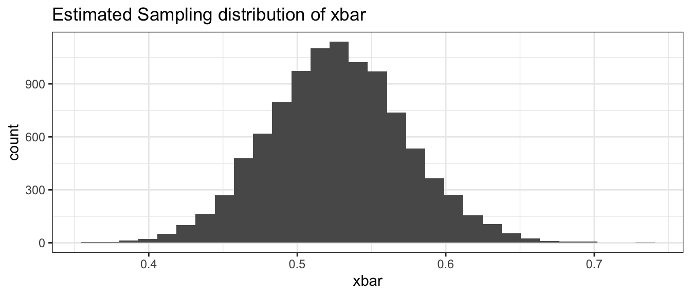
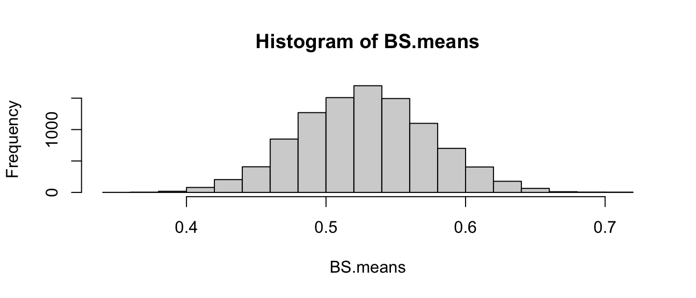

# Appendix A : Alternative Bootstrap Code {-}


## Mosaic Package {-}


```r
library(ggplot2)    # graphing functions
library(dplyr)      # data summary tools
library(mosaic)     # using Mosaic for iterations

# Set default behavior of ggplot2 graphs to be black/white theme
theme_set(theme_bw())
```

This method uses the `mosaic` package and can work very well when everything is in data frames.


```r
# read the Lakes data set
Lakes <- read.csv('http://www.lock5stat.com/datasets/FloridaLakes.csv')

# create the Estimated Sampling Distribution of xbar
BootDist <- mosaic::do(10000) * 
  mosaic::resample(Lakes) %>% 
  summarise(xbar = mean(AvgMercury))

# what columns does the data frame "BootDist" have?
head(BootDist)
```

```
##        xbar
## 1 0.5152830
## 2 0.5045283
## 3 0.5067925
## 4 0.4939623
## 5 0.5294340
## 6 0.5035849
```

```r
# show a histogram of the estimated sampling distribution of xbar
ggplot(BootDist, aes(x=xbar)) +
  geom_histogram() + 
  ggtitle('Estimated Sampling distribution of xbar' )
```



```r
# calculate a quantile-based confidence interval
quantile(BootDist$xbar, c(0.025, 0.975))
```

```
##      2.5%     97.5% 
## 0.4377358 0.6207547
```

## Base R Code {-}

Here, no packages are used and the steps of the bootstrap are more explicit.


```r
AvgMerc <- Lakes$AvgMercury
Boot.Its<-10000  ### Numer of iterations, like `R` in `boot`
Sample.Size<-length(AvgMerc)
BS.means<-numeric() ### where each estimate is saved
for(j in 1:Boot.Its) BS.means[j]<-mean(sample(AvgMerc, Sample.Size, replace=T))
hist(BS.means)
```



Then the 95% confidence interval can be found in a similar manner to above.


```r
quantile(BS.means, c(0.025, 0.975))
```

```
##      2.5%     97.5% 
## 0.4383019 0.6215094
```
